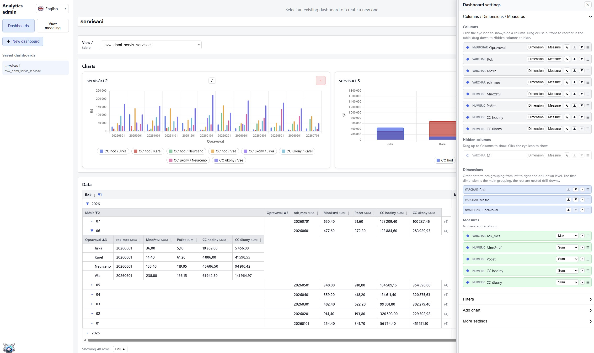
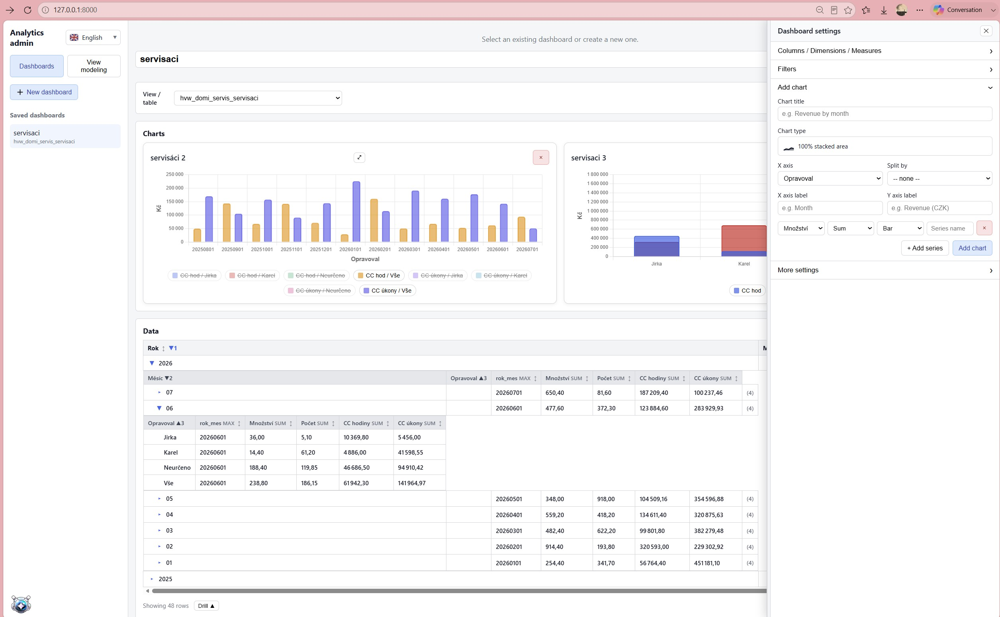
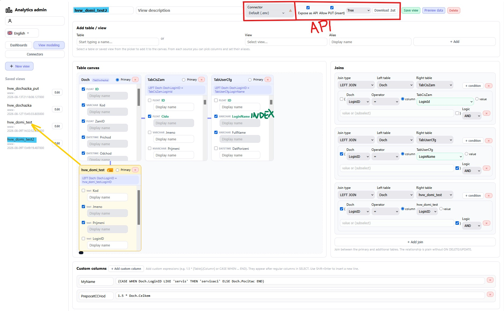
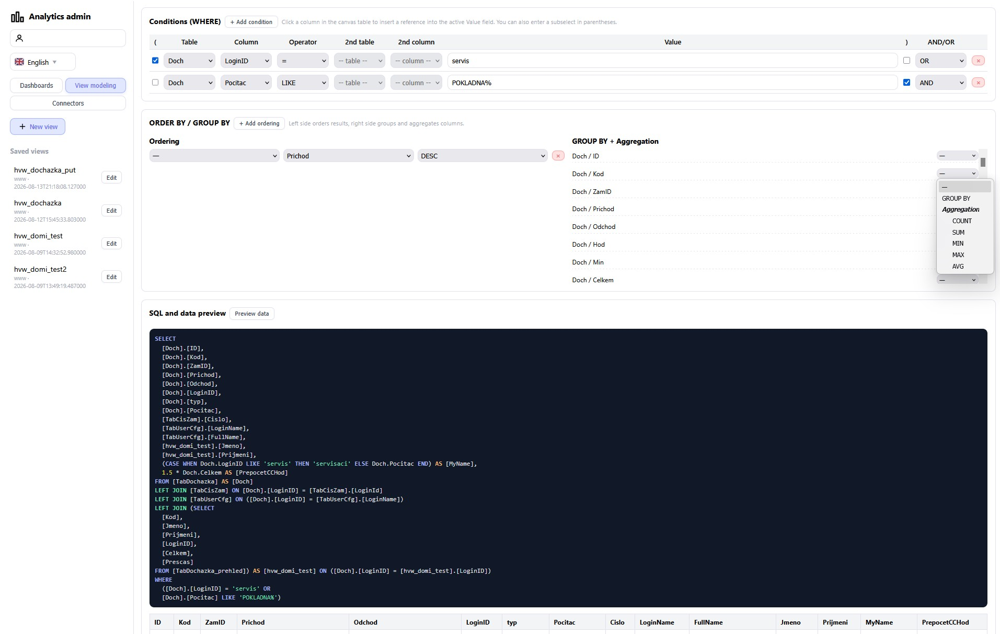
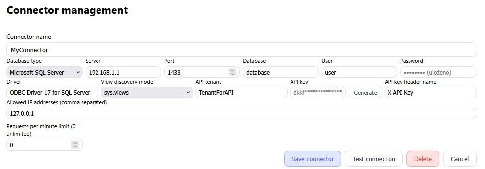

# Business Intelligence Analytics Admin — Features

## Overview

Analytics Admin is a multi-user business intelligence platform that allows organizations to connect to their databases, model data views, and build interactive dashboards. Each user operates within an isolated workspace, with dedicated connectors, views, and dashboards.

---

## Multi-User Architecture

- Multi-user environment with separated connectors, views, and dashboards per user
- Account registration and authentication handled exclusively through email
- Multi-language interface support

---

## Database Connectors

- Supported database engines: Microsoft SQL Server, MySQL, MariaDB, PostgreSQL, and SQLite
- Allowed IP addresses configurable independently for each connector's API access
- API authentication via bearer key, with a configurable custom header name
- API tenant identifier for connector-level access control
- Configurable maximum request rate (requests per minute)

---

## View Modeling

The view modeling layer allows users to define reusable data structures on top of source tables and views.

- Modeling based on tables and views, with support for subviews
- Selection of the source connector for each view
- One-click exposure of a view as an API endpoint
- API access supports GET requests in both tabular and tree (hierarchical) structures, as well as PUT requests
- Downloadable sample `.bat` script demonstrating API usage
- Renaming of tables and columns to custom aliases directly by clicking on the column header
- Color-coded visual indication when a subview is added to the model
- Column selection for inclusion in a view via checkboxes
- Visual display of join conditions between tables
- Support for adding custom columns and custom conditions, with built-in protection against SQL injection
- Enhanced graphical interface for building WHERE conditions
- Support for ORDER BY and GROUP BY clauses
- Automatic SQL query generation with syntax highlighting
- Live data preview

---

## Dashboards

- Tabular display of data sourced from a view
- Automatic removal of NULL values from displayed results
- Conditional formatting of numeric values: positive values shown in green, negative values shown in red
- Support for numeric and date/time formatting
- Configurable row limits
- Automatic detection of data types to generate appropriate filtering conditions for a view

### Pivot Tables

- Creation of pivot (cross-tabulated) tables
- Column hiding and reordering
- Configuration of pivot dimensions and aggregation functions: Sum, Count, Average, Maximum, and Minimum
- Display of columns that are neither assigned as dimensions nor as metrics

### Charts

- Chart creation from a library of 17 predefined chart types
- Configuration of X and Y axes, with support for additional series
- Each series can be independently defined as a column (bar) or a line
- Further breakdown of a series by an additional dimension, based on a selected column
- Ability to show or hide individual values in the chart legend
- Toggle for displaying or hiding gridlines
- Configuration of chart dimensions and layout, including the number of charts displayed per row

---

## Security

- Transport security via SSL, supporting both PEM and PFX certificate formats
- Globally configurable trusted hosts (allowed IP addresses)
- CORS, Content Security Policy (CSP), and HSTS enforcement
- Request and access logging
- JWT secret used for verification of web tokens
- API bearer key and tenant identifier configured individually for each user and each connector
- Trusted host IP addresses configurable independently for each connector
- Configurable maximum request rate (requests per minute)
- Registration and authentication via email, with session validity limited by a defined time period
- Prevention of duplicate concurrent sessions

---

## Requirements and Installation

The application is started with the following command:

```
python -m src.web.server
```

### Dependencies

**Core**
- python-dotenv >= 1.0.0

**Data Science**
- numpy >= 1.24.0
- pandas >= 2.0.0
- scipy >= 1.10.0
- scikit-learn >= 1.3.0
- matplotlib >= 3.7.0
- seaborn >= 0.12.0
- jupyter >= 1.0.0
- notebook >= 6.5.0

**Web**
- fastapi >= 0.95.0
- uvicorn >= 0.21.0
- jinja2 >= 3.1.0
- requests >= 2.28.0

**Database**
- pyodbc >= 4.0.0 (MSSQL / SQL Server)
- sqlalchemy >= 2.0.0
- pymssql >= 2.2.0
- pymysql >= 1.0.2 (MySQL / MariaDB connector)
- psycopg2-binary >= 2.9.0 (PostgreSQL connector)
- sqlite3 (SQLite) is included in the Python standard library and requires no separate package

**Office / Export**
- openpyxl >= 3.1.0

**Utilities**
- python-dateutil >= 2.8.0
- tqdm >= 4.65.0
- cryptography >= 41.0.0 (PFX/PKCS12 extraction for HTTPS)

---

## Screenshots











---
